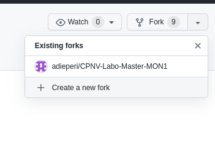
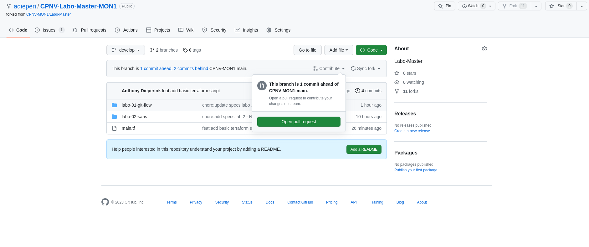
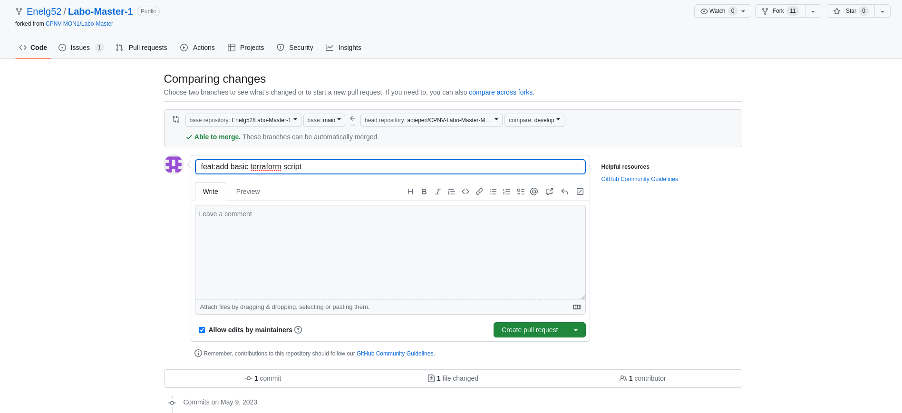
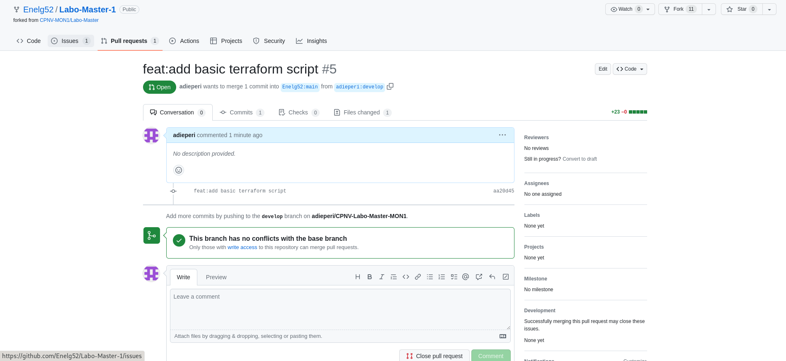
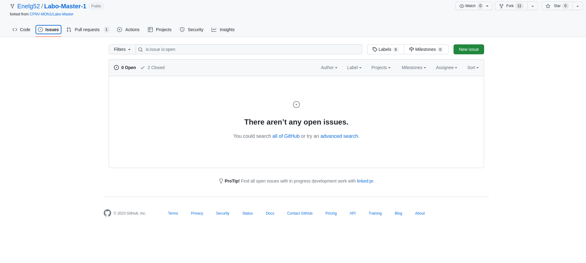
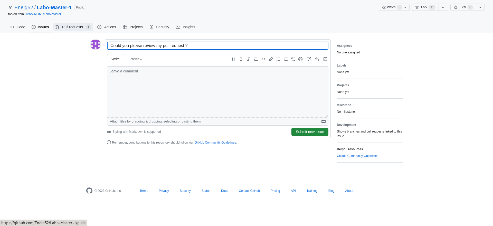
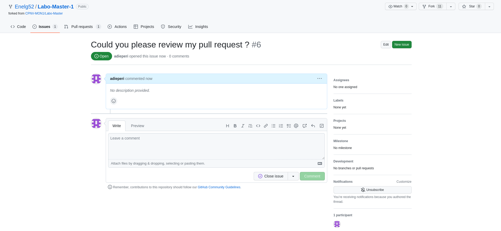

# Fork process

[Source](https://docs.github.com/en/get-started/quickstart/fork-a-repo)

<figure><figcaption><p>Git-flow scenario to master</p></figcaption></figure>

* [X] Fork the "upstream" repository in your github organisation



* [X] Clone "teacher" repo in your local machine

```
[INPUT]
git clone git@github.com:CPNV-MON1/Labo-Master.git

[OUTPUT]
╭─adieperi@ad-laptop ~/Documents/code/anthonydieperink/github.com/CPNV  
╰─➤  g clone git@github.com:CPNV-MON1/Labo-Master.git                                                 
Cloning into 'Labo-Master'...
The authenticity of host 'github.com (140.82.121.4)' can't be established.
RSA key fingerprint is SHA256:uNiVztksCsDhcc0u9e8BujQXVUpKZIDTMczCvj3tD2s.
Are you sure you want to continue connecting (yes/no/[fingerprint])? yes
Warning: Permanently added 'github.com,140.82.121.4' (RSA) to the list of known hosts.
remote: Enumerating objects: 16, done.
remote: Counting objects: 100% (16/16), done.
remote: Compressing objects: 100% (15/15), done.
remote: Total 16 (delta 1), reused 14 (delta 0), pack-reused 0
Receiving objects: 100% (16/16), 4.71 KiB | 4.71 MiB/s, done.
Resolving deltas: 100% (1/1), done.

```

* [X] Init Git flow (with standard settings)

```
[INPUT]
git flow init

[OUTPUT]
╭─adieperi@ad-laptop ~/Documents/code/anthonydieperink/github.com/CPNV-Labo-Master-MON1  ‹main› 
╰─➤  g flow init                                                 

Which branch should be used for bringing forth production releases?
   - main
Branch name for production releases: [main] 
Branch name for "next release" development: [develop] 

How to name your supporting branch prefixes?
Feature branches? [feature/] 
Bugfix branches? [bugfix/] 
Release branches? [release/] 
Hotfix branches? [hotfix/] 
Support branches? [support/] 
Version tag prefix? [] 
Hooks and filters directory? [/home/adieperi/Documents/code/anthonydieperink/github.com/CPNV-Labo-Master-MON1/.git/hooks]

```

* [ ] Update your develop branch directly to the upstream (main branch)

```
[INPUT]
git merge main develop

[OUTPUT]
╭─adieperi@ad-laptop ~/Documents/code/anthonydieperink/github.com/CPNV-Labo-Master-MON1  ‹develop› 
╰─➤  g merge main develop 
Already up to date.

```

* [X] Create a branch feature called "terraformBasicScript"

```
[INPUT]
git flow feature start terraformBasicScript

[OUTPUT]
╭─adieperi@ad-laptop ~/Documents/code/anthonydieperink/github.com/CPNV-Labo-Master-MON1  ‹develop› 
╰─➤  g flow feature start terraformBasicScript
Switched to a new branch 'feature/terraformBasicScript'

Summary of actions:
- A new branch 'feature/terraformBasicScript' was created, based on 'develop'
- You are now on branch 'feature/terraformBasicScript'

Now, start committing on your feature. When done, use:

     git flow feature finish terraformBasicScript

```

* [X] Add this code and commit it (feat:add basic terraform script")

```
terraform {
  required_providers {
    aws = {
      source  = "hashicorp/aws"
      version = "~> 4.16"
    }
  }

  required_version = ">= 1.2.0"
}

provider "aws" {
  region  = "us-west-2"
}

resource "aws_instance" "app_server" {
  ami           = "ami-830c94e3"
  instance_type = "t2.micro"

  tags = {
    Name = "ExampleAppServerInstance"
  }
}
```

```
[INPUT]
git add main.tf
git commit -m "feat:add basic terraform script"

[OUTPUT]
╭─adieperi@ad-laptop ~/Documents/code/anthonydieperink/github.com/CPNV-Labo-Master-MON1  ‹feature/terraformBasicScript*› 
╰─➤  g commit -m "feat:add basic terraform script"            
[feature/terraformBasicScript aa20d45] feat:add basic terraform script
 1 file changed, 23 insertions(+)
 create mode 100644 main.tf

```

* [ ] Finish the feature

```
[INPUT]
git flow feature finish terraformBasicScript

[OUTPUT]
╭─adieperi@ad-laptop ~/Documents/code/anthonydieperink/github.com/CPNV-Labo-Master-MON1  ‹feature/terraformBasicScript› 
╰─➤  git flow feature finish terraformBasicScript
Switched to branch 'develop'
Updating cf09931..aa20d45
Fast-forward
 main.tf | 23 +++++++++++++++++++++++
 1 file changed, 23 insertions(+)
 create mode 100644 main.tf
Deleted branch feature/terraformBasicScript (was aa20d45).

Summary of actions:
- The feature branch 'feature/terraformBasicScript' was merged into 'develop'
- Feature branch 'feature/terraformBasicScript' has been locally deleted
- You are now on branch 'develop'

```

* Push this modification on your repository

```
[INPUT]
git push --set-upstream origin develop

[OUTPUT]
╭─adieperi@ad-laptop ~/Documents/code/anthonydieperink/github.com/CPNV-Labo-Master-MON1  ‹develop› 
╰─➤  git push --set-upstream origin develop                                                                                                                            128 ↵
Enumerating objects: 4, done.
Counting objects: 100% (4/4), done.
Delta compression using up to 8 threads
Compressing objects: 100% (3/3), done.
Writing objects: 100% (3/3), 545 bytes | 545.00 KiB/s, done.
Total 3 (delta 0), reused 0 (delta 0), pack-reused 0
remote: 
remote: Create a pull request for 'develop' on GitHub by visiting:
remote:      https://github.com/adieperi/CPNV-Labo-Master-MON1/pull/new/develop
remote: 
To github.com:adieperi/CPNV-Labo-Master-MON1.git
 * [new branch]      develop -> develop
Branch 'develop' set up to track remote branch 'develop' from 'origin'.

```

* What happens to the feature/branch ?

```
Elle a été supprimée
git branch
```

* Open a pull request comparing your develop branch to your main
* Assign the pull request to your partner





* Notify him using a issue "Could you please review my pull request ?"




