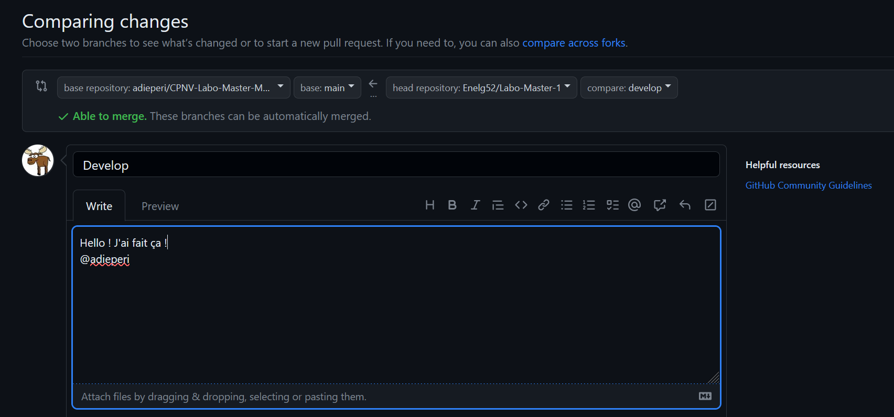
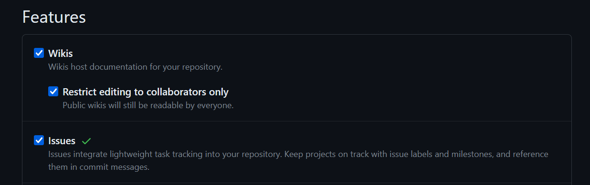
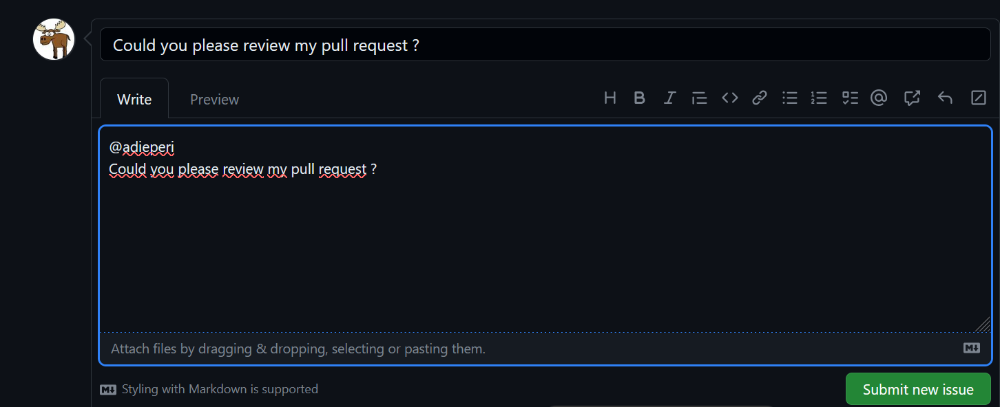
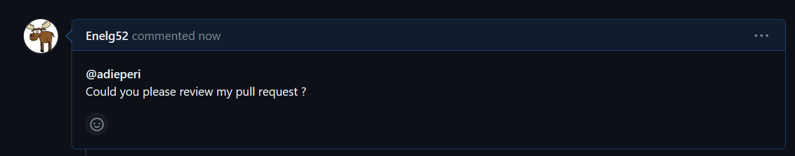

# Fork process

[Source](https://docs.github.com/en/get-started/quickstart/fork-a-repo)

<figure><figcaption><p>Git-flow scenario to master</p></figcaption></figure>

* [ ] Fork the "upstream" repository in your github organisation


* [ ] Clone "teacher" repo in your local machine

```
[INPUT]
git clone https://github.com/Enelg52/Labo-Master-1.git

[OUTPUT]
Cloning into 'Labo-Master-1'...
remote: Enumerating objects: 12, done.
remote: Counting objects: 100% (12/12), done.
remote: Compressing objects: 100% (11/11), done.
remote: Total 12 (delta 0), reused 12 (delta 0), pack-reused 0
Receiving objects: 100% (12/12), 4.28 KiB | 547.00 KiB/s, done.
```

* [ ] Init Git flow (with standard settings)

```
[INPUT]
git flow init

[OUTPUT]
Which branch should be used for bringing forth production releases?
   - main
Branch name for production releases: [main]
Branch name for "next release" development: [develop]

How to name your supporting branch prefixes?
Feature branches? [feature/]
Bugfix branches? [bugfix/]
Release branches? [release/]
Hotfix branches? [hotfix/]
Support branches? [support/]
Version tag prefix? []
Hooks and filters directory? [C:/Users/yanng/Documents/CPNV/MON1/Labo-Master-1/.git/hooks]
```

* [ ] Update your develop branch directly to the upstream (main branch)

```
[INPUT]
git remote add upstream https://github.com/CPNV-MON1/Labo-Master.git
git remote -v

git pull upstream main

[OUTPUT]
origin  https://github.com/Enelg52/Labo-Master-1.git (fetch)
origin  https://github.com/Enelg52/Labo-Master-1.git (push)
upstream        https://github.com/CPNV-MON1/Labo-Master.git (fetch)
upstream        https://github.com/CPNV-MON1/Labo-Master.git (push)

git pull upstream main
From https://github.com/CPNV-MON1/Labo-Master
 * branch            main       -> FETCH_HEAD
 * [new branch]      main       -> upstream/main
Already up to date.
```

* [ ] Create a branch feature called "terraformBasicScript"

```
[INPUT]
git flow feature start terraformBasicScript

[OUTPUT]
Switched to a new branch 'feature/terraformBasicScript'

Summary of actions:
- A new branch 'feature/terraformBasicScript' was created, based on 'develop'
- You are now on branch 'feature/terraformBasicScript'

Now, start committing on your feature. When done, use:

     git flow feature finish terraformBasicScript
```

* [ ] Add this code and commit it (feat:add basic terraform script")

```
terraform {
  required_providers {
    aws = {
      source  = "hashicorp/aws"
      version = "~> 4.16"
    }
  }

  required_version = ">= 1.2.0"
}

provider "aws" {
  region  = "us-west-2"
}

resource "aws_instance" "app_server" {
  ami           = "ami-830c94e3"
  instance_type = "t2.micro"

  tags = {
    Name = "ExampleAppServerInstance"
  }
}
```

```
[INPUT]
git add .
git commit -m "feat:add basic terraform script"

[OUTPUT]
[feature/terraformBasicScript 3e330dd] feat:add basic terraform script
 1 file changed, 23 insertions(+)
 create mode 100644 labo-01-git-flow/TerraScript
```

* [ ] Finish the feature

```
[INPUT]
git flow feature finish terraformBasicScript

[OUTPUT]
Switched to branch 'develop'
Updating ee74e87..3e330dd
Fast-forward
 labo-01-git-flow/TerraScript | 23 +++++++++++++++++++++++
 1 file changed, 23 insertions(+)
 create mode 100644 labo-01-git-flow/TerraScript
Deleted branch feature/terraformBasicScript (was 3e330dd).

Summary of actions:
- The feature branch 'feature/terraformBasicScript' was merged into 'develop'
- Feature branch 'feature/terraformBasicScript' has been locally deleted
- You are now on branch 'develop'
```

* Push this modification on your repository

```
[INPUT]
git push --set-upstream origin develop

[OUTPUT]
Enumerating objects: 21, done.
Counting objects: 100% (21/21), done.
Delta compression using up to 8 threads
Compressing objects: 100% (17/17), done.
Writing objects: 100% (18/18), 17.68 KiB | 4.42 MiB/s, done.
Total 18 (delta 3), reused 0 (delta 0), pack-reused 0
remote: Resolving deltas: 100% (3/3), done.
remote:
remote: Create a pull request for 'develop' on GitHub by visiting:
remote:      https://github.com/Enelg52/Labo-Master-1/pull/new/develop
remote:
To https://github.com/Enelg52/Labo-Master-1.git
 * [new branch]      develop -> develop
branch 'develop' set up to track 'origin/develop'.
```

* What happens to the feature/branch ?

La feature à été enlevée

```
[INPUT]
git branch

[OUTPUT]
* develop
  main
```

* Open a pull request comparing your develop branch to your main
* Assign the pull request to your partner



Il faut activer la section issues.



* Notify him using a issue "Could you please review my pull request ?"





