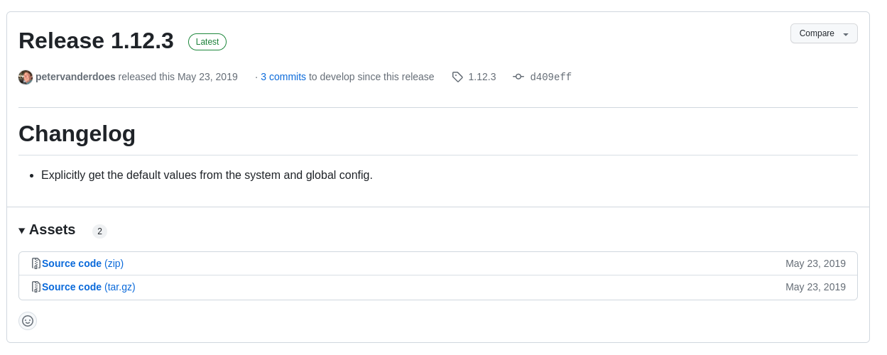

# Prerequisites

## Setting up/updating the git environment and git flow

[Get the installer](https://git-scm.com/downloads)


Git-flow library:\
For Windows, is natively integrated.\
For Mac, [here is the procedure](https://git-scm.com/download/mac).\
Pour Linux, [here is the procedure.](https://howtoinstall.co/en/git-flow)


```
[INPUT]
sudo apt install git-flow

[OUTPUT]
╭─adieperi@ad-laptop ~/Documents/code/anthonydieperink/github.com/CPNV-Labo-Master-MON1  ‹develop*› 
╰─➤  sudo apt install git-flow                                                                                                                      130 ↵
Reading package lists... Done
Building dependency tree... Done
Reading state information... Done
git-flow is already the newest version (1.12.3-3).
0 upgraded, 0 newly installed, 0 to remove and 0 not upgraded.

```

* [ ] Confirm the installed version

```
[INPUT]
git flow version

[OUTPUT]
╭─adieperi@ad-laptop ~/Documents/code/anthonydieperink/github.com/CPNV-Labo-Master-MON1  ‹develop*› 
╰─➤  git flow version                            
1.12.3 (AVH Edition)

```

* [ ] What do you think about this release?



## What's git-flow, branches feature.

[Source](https://nvie.com/posts/a-successful-git-branching-model/)

<figure><figcaption><p>Source : A successful git branching model</p></figcaption></figure>

* [ ] Which branches are persistent and what do they contain?

```
La branch main/master et develop.
main/master -> branch stable
develop -> branch unstable
```

* [ ] Why do we have to merge hotfix in both master and develop branches, but not into all active feature branches?

```
Car les actives feature branches auront les changement lors de l'application de la feature avec un merge.
```

## Initialize git flow on an existing project

* [ ] What happens when you run the "git flow init" command on an existing local repository?

```
Cela va initialiser git flow et switch sur la branch develop
```

* [ ] When do we need to make this git command?

```
Après le clone d'un repo
```

## Practice the basic git commands

[Source](https://www.atlassian.com/git/glossary)

* [ ] What does this git command "git add -all" achieve (.gitignore impacts)?

```
Elle ajoute tous les changements ou repo et annule l'effet du .gitignore
```

* [ ] What does this git command "git status" achieve?

```
Affiche fichier staged, not staged, untracked et etc...
```

* [ ] What does this git command "git remote add upstream \<url>" achieve?

```
Cela ajoute un nouveau remote au repo local
```
