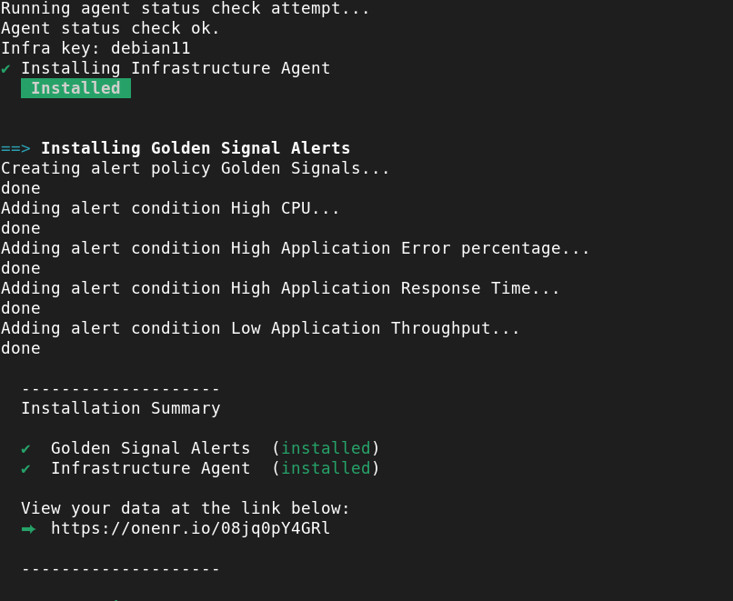
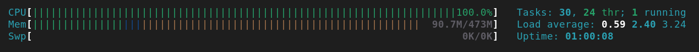
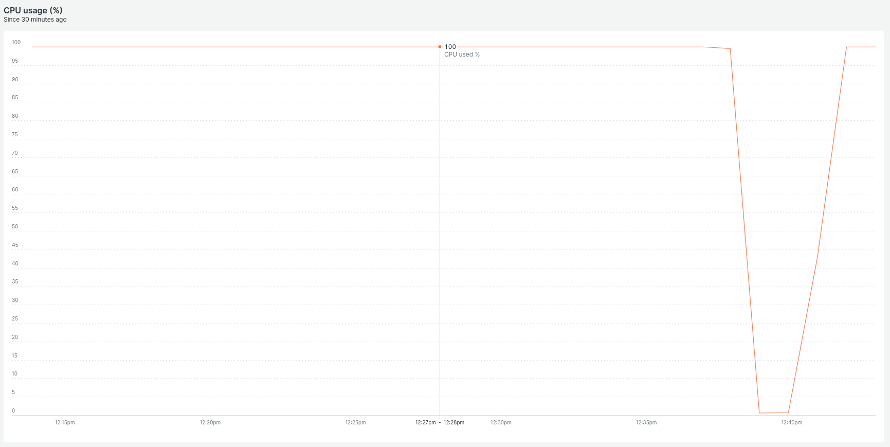
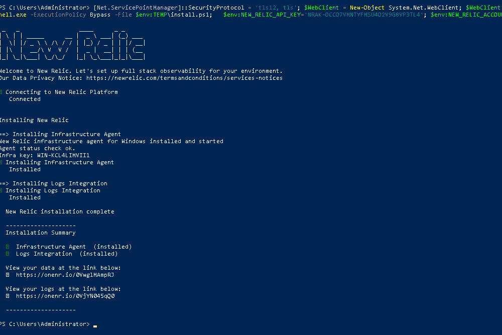
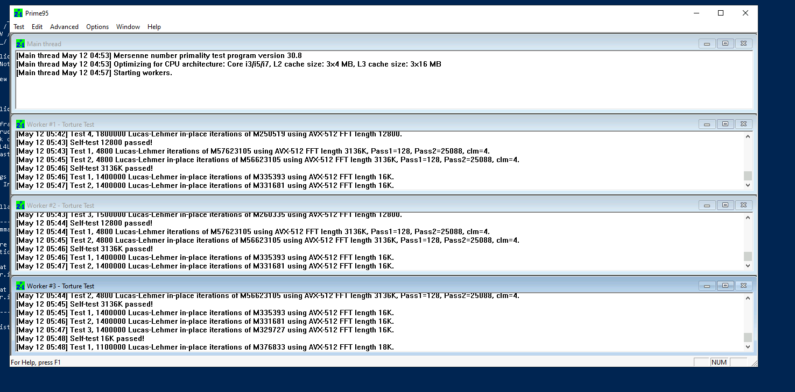
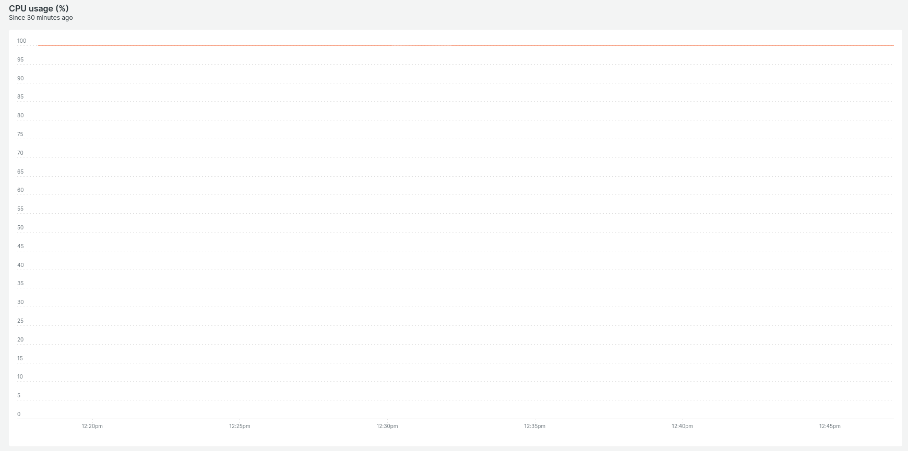

# New Relic

## Linux

```bash
sudo curl -Ls https://download.newrelic.com/install/newrelic-cli/scripts/install.sh | bash && sudo  NEW_RELIC_API_KEY=NRAK-OCCO7VMNTYFMSU4O2V9G8VP3TL4 NEW_RELIC_ACCOUNT_ID=3933746 NEW_RELIC_REGION=EU /usr/local/bin/newrelic install
```

> Need sudo & curl



### Stress

```
sudo apt install htop stress
```

```
stress -c 4
```

### htop



### New Relic



## Windows

```powershell
[Net.ServicePointManager]::SecurityProtocol = 'tls12, tls'; $WebClient = New-Object System.Net.WebClient; $WebClient.DownloadFile("https://download.newrelic.com/install/newrelic-cli/scripts/install.ps1", "$env:TEMP\install.ps1"); & PowerShell.exe -ExecutionPolicy Bypass -File $env:TEMP\install.ps1;   $env:NEW_RELIC_API_KEY='NRAK-OCCO7VMNTYFMSU4O2V9G8VP3TL4'; $env:NEW_RELIC_ACCOUNT_ID='3933746'; $env:NEW_RELIC_REGION='EU'; & 'C:\Program Files\New Relic\New Relic CLI\newrelic.exe' install
```



### Prime 95



